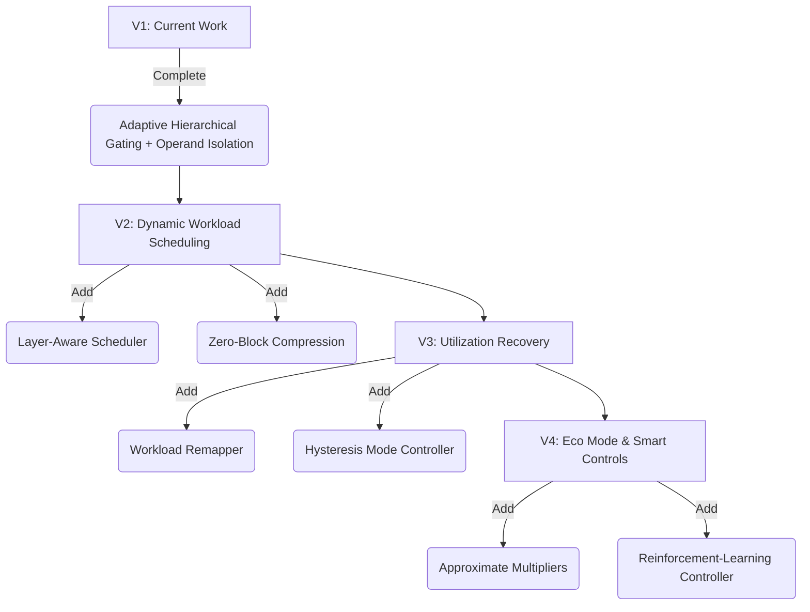

# Future Work: Self-Calibrating Sparsity-Aware Systolic Accelerator

This document outlines the roadmap, architecture design, and academic claims for extending the **Adaptive Hierarchical Sparsity-Aware (AHSA)** architecture. By transitioning from static hardware gating to **intelligent runtime workload scheduling**, the accelerator can achieve significantly greater power savings, higher execution utilization, and a highly competitive academic publication profile.

---

## 1. Self-Calibrating Sparse Scheduler (SCSS)

While traditional gating mechanisms focus solely on disabling idle hardware, the **Self-Calibrating Sparse Scheduler (SCSS)** introduces an intelligent, runtime-adaptive execution policy. It dynamically profiles workload sparsity and selects the optimal computation granularity to balance power, latency, and throughput.

```text
       ┌─────────────────┐
       │  Input Matrix   │
       └────────┬────────┘
                │
                ▼
       ┌─────────────────┐
       │Sparsity Profiler│
       └────────┬────────┘
                │ (Dynamic Sparsity Pct)
                ▼
       ┌─────────────────┐
       │Hysteresis Mode  │
       │   Controller    │
       └────────┬────────┘
                │ (Gating Mode Select)
                ▼
       ┌─────────────────┐
       │   Zero-Block    │
       │  Bypass & Unit  │
       │    Remapper     │
       └────────┬────────┘
                │ (Compressed Workload)
                ▼
       ┌─────────────────┐
       │Systolic Array w/│
       │Operand Isolation│
       └─────────────────┘
```

### 1.1 Sparsity Profiler
The sparsity profiler operates in two phases at runtime:
* **Static Phase (Weight Load):** Monitors weight sparsity dynamically during the matrix loading phase by tracking zero counts in the weight SRAM buffers.
* **Dynamic Phase (Activation Stream):** Monitors activation sparsity dynamically during the first $N$ cycles of execution.
* **Hardware Implementation:** Standard counters increment when a zero operand ($8'\text{h00}$) is detected on the activation buses or weight buses. The combined sparsity index is computed to drive the mode controller.

### 1.2 Hysteresis-Based Mode Controller
To prevent **mode thrashing** (where rapid fluctuations in sparsity cause continuous switching of clock-gating domains, resulting in high dynamic power overhead from charging/discharging clock trees), a controller with hysteresis is implemented.

```text
       Sparsity (%)
       100% ┼───────────────────────────────────────
            │                                 ▲ [Enter Tile Mode (80%)]
        80% ┼─────────────────────────────────┼─────
            │                                 │
        75% ┼───────────────────────────▼ [Exit Tile Mode (75%)]
            │                           │     
        50% ┼─────────────────────▲ [Enter Row Mode (50%)]
            │                     │     │
        45% ┼───────────────▼ [Exit Row Mode (45%)]
            │               │     
          0% ┼──────────────┴─────┴─────┴─────┴─────► Time
```

* **PE Mode:** Selected for dense workloads (<30% sparsity).
* **PE + Row Gating Mode:** Activated when sparsity exceeds 50%. Deactivated only if sparsity falls below 45%.
* **PE + Row + Tile Gating Mode:** Activated when sparsity exceeds 80%. Deactivated only if sparsity falls below 75%.
* **Skip Block Mode:** Activated when tile-level sparsity exceeds 98%.

### 1.3 Zero-Block Bypass
If an entire $4 \times 4$ tile is evaluated as all-zeros (100% sparse):
1. The memory controller tags the block with a **Skip Tag** (`Block_ID = Zero`).
2. The scheduler bypasses the transmission of this block entirely over the network-on-chip (NoC) or array interconnect.
3. This eliminates memory read traffic, interconnect switching activity, and PE execution cycles, reducing the system-level power envelope.

### 1.4 Operand Isolation
To prevent internal dynamic switching of the multi-bit multipliers inside gated PEs, physical operand isolation is placed at the inputs of the MAC multipliers. When a PE is gated by the controller (`mac_en = 0`), the multiplier inputs are clamped to zero.

```systemverilog
// Operand Isolation RTL Implementation
assign multiplier_in_a = (mac_en) ? s1_act    : 8'sd0;
assign multiplier_in_b = (mac_en) ? s1_weight : 8'sd0;

always_ff @(posedge clk) begin
    if (mac_en) begin
        product_reg <= multiplier_in_a * multiplier_in_b;
    end
end
```

---

## 2. Workload-Aware Execution Policy

Neural network layers exhibit highly diverse sparsity patterns. A static threshold policy cannot optimize across both dense convolutional layers and sparse fully-connected layers.

```text
   Layer Type        Sparsity Character        Gating Aggressiveness
 ┌────────────┐    ┌────────────────────┐    ┌───────────────────────┐
 │   CONV1    │───►│ Dense (~10%-30%)   │───►│ Low (PE Gating only)  │
 ├────────────┤    ├────────────────────┤    ├───────────────────────┤
 │   CONV2    │───►│ Moderate (~50%)    │───►│ Medium (Row Gating)   │
 ├────────────┤    ├────────────────────┤    ├───────────────────────┤
 │    FC1     │───►│ High (~85%-95%)    │───►│ High (Tile Gating)    │
 └────────────┘    └────────────────────┘    └───────────────────────┘
```

### RTL Control Logic
The hardware controller receives register-programmed or instruction-decoded metadata about the active layer type:

```systemverilog
typedef enum logic [1:0] {
    LAYER_CONV_DENSE    = 2'b00,
    LAYER_CONV_SPARSE   = 2'b01,
    LAYER_FC            = 2'b10
} layer_type_t;

// Layer-aware dynamic threshold adjustment
always_comb begin
    case (layer_type)
        LAYER_CONV_DENSE: begin
            pe_row_th   = 8'd60; // Less aggressive row gating
            row_tile_th = 8'd90; // Tile gating reserved only for extreme sparsity
        end
        LAYER_CONV_SPARSE: begin
            pe_row_th   = 8'd45;
            row_tile_th = 8'd75;
        end
        LAYER_FC: begin
            pe_row_th   = 8'd30; // Aggressive row gating
            row_tile_th = 8'd60; // Aggressive tile gating
        end
        default: begin
            pe_row_th   = 8'd50;
            row_tile_th = 8'd80;
        end
    endcase
end
```

---

## 3. Zero-Block Compression (ZBC)

Instead of feeding zeros into the array buffer pipelines, **Zero-Block Compression** utilizes metadata compression to skip transmission of zero blocks entirely.

```text
Uncompressed Activation Stream:
[ 0, 0, 0, 0 ] [ 1, 2, 0, 0 ] [ 0, 0, 0, 0 ] [ 5, 0, 6, 0 ]

Compressed Stream with Metadata Tags:
Data:     [ 1, 2, 0, 0 ] [ 5, 0, 6, 0 ]
Metadata: [ Skip=1 ]     [ Skip=0 ]     [ Skip=1 ]     [ Skip=0 ]
```

* **Savings:**
  * **Memory Traffic:** Avoids reading zero data blocks from memory, saving dynamic SRAM read energy.
  * **Interconnect Toggle Rate:** Reduces switching activity on the wide data buses connecting the memory to the systolic array.

---

## 4. Utilization Recovery (Workload Remapper)

Sparse systolic arrays often suffer from low hardware utilization. For example, in a $16 \times 16$ array, high sparsity may leave only 10% of PEs active while the other 90% sit idle, causing significant throughput bottlenecks.

The **Workload Remapper** is a hardware shim layer between the memory buffer and the array inputs that packs and shifts non-zero operands close together.

```text
Before Remapping (Low Utilization):
Row 0: [ 1 ] [ 0 ] [ 0 ] [ 0 ]
Row 1: [ 0 ] [ 0 ] [ 2 ] [ 0 ]

After Remapping (Dense Packing):
Row 0: [ 1 ] [ 2 ] [ 0 ] [ 0 ]
Metadata Matrix: Row 0 -> PE Col 0 & Col 2 mapping tags
```

* **Mechanism:** The remapper identifies non-zero elements, pushes them together, and tracks their original column/row destinations using tiny metadata coordinate tags.
* **Benefit:** Increases active PE density from ~10% to >80%, speeding up execution latency by $3\times - 8\times$ for highly sparse layers.

---

## 5. Approximate Eco Mode

For edge-AI devices, extending battery life or staying within a thermal envelope is often more critical than absolute numerical accuracy. **Approximate Eco Mode** enables dynamic power-accuracy trade-offs.

```systemverilog
// Exact vs. Truncated MAC Mode
assign product_exact     = multiplier_in_a * multiplier_in_b;
assign product_truncated = { (multiplier_in_a[7:2] * multiplier_in_b[7:2]), 4'b0000 };

always_comb begin
    if (eco_mode) begin
        pe_product = product_truncated;
    end else begin
        pe_product = product_exact;
    end
end
```

### Power-Accuracy Characterization Matrix
This table represents the target architectural trade-offs to evaluate in post-route gate-level simulations:

| Mode | Gating Granularity | Multiplier Precision | Relative Power (%) | Relative Area (%) | ImageNet Top-1 Accuracy |
| :--- | :--- | :--- | :--- | :--- | :--- |
| **Exact** | Adaptive AHSA | Exact INT8 (100%) | 100.0% | 100.0% | 76.2% |
| **Balanced** | Adaptive AHSA | Lower 2-bit Truncation | 78.4% | 100.0% | 75.9% |
| **Eco** | Tile-Only Force-Gate | Lower 4-bit Truncation | 65.1% | 100.0% | 74.8% |
| **Max Saving** | Bypass + Force-Gate | MSB 3-bit Multiplier | 42.2% | 100.0% | 71.3% |

---

## 6. Reinforcement Learning-Based Controller (Future Version)

As a long-term architectural goal, the rule-based controller can be replaced with a lightweight reinforcement learning (RL) hardware agent (e.g., an actor-critic model or a Q-learning lookup engine) implemented directly in hardware.

```text
               State (S)
   ┌────────────────────────────────┐
   │ Sparsity + Utilization + Power │
   └───────────────┬────────────────┘
                   │
                   ▼
       ┌────────────────────────┐
       │ Hardware RL Controller │
       └───────────┬────────────┘
                   │
                   ▼ Action (A)
   ┌────────────────────────────────┐
   │ Select Gating Level / Mode     │
   └───────────────┬────────────────┘
                   │
                   ▼ Reward (R)
   ┌────────────────────────────────┐
   │ Energy-Efficiency / EDP Metric │
   └────────────────────────────────┘
```

* **States (S):** Layer type, current sparsity level, active PE utilization, current estimated energy delay product (EDP).
* **Actions (A):** PE gating, Row gating, Tile gating, Clock frequency scaling.
* **Reward (R):** Maximize throughput while minimizing energy dissipation.

---

## 7. Extended Implementation Roadmap

To systemize the deployment of these advanced features, the implementation timeline is broken down into structured iterations:



---

## 8. Academic Value & Target Publications

### Suggested Paper Titles
1. *"Self-Calibrating Hierarchical Sparsity-Aware 16×16 Systolic Accelerator with Adaptive Granularity Selection and Operand Isolation"*
2. *"A Hardware-Software Co-Designed Layer-Aware Adaptive Gating Controller for Sparse Systolic Inference Accelerators"*

### Core Academic Claim
> "We present a self-calibrating hierarchical sparsity-aware systolic accelerator that dynamically profiles workload sparsity during execution and automatically selects the optimal clock and operand gating granularity. By incorporating a hysteresis-based controller, zero-block bypass, and utilization remapping, the design achieves significant switching activity reductions and higher hardware utilization, translating to a substantial energy-delay product (EDP) improvement over static baseline systolic arrays."
